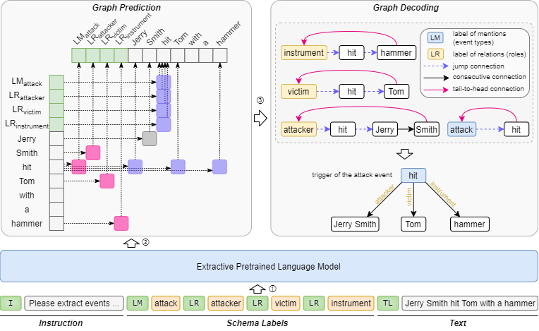
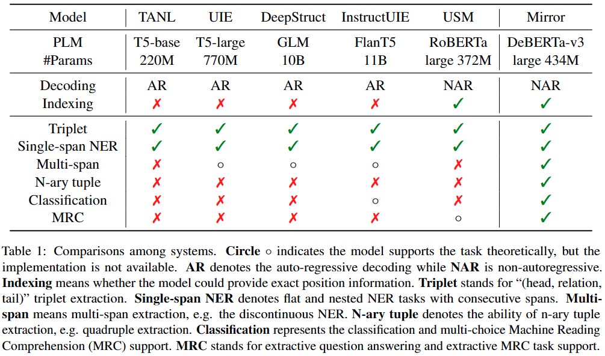
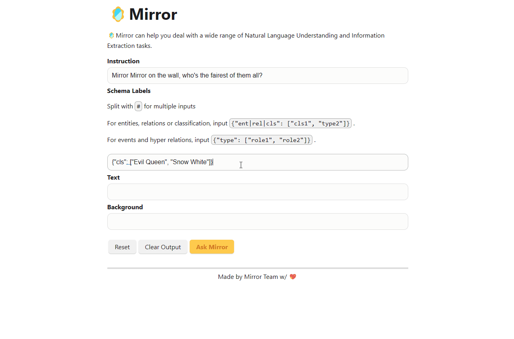

<!-- ---
title: Mirror
emoji: 🪞
colorFrom: blue
colorTo: yellow
sdk: docker
app_port: 7860
pinned: true
license: apache-2.0
---
 -->

<div align="center">
  <h1>🪞 Mirror: A Universal Framework for Various Information Extraction Tasks</h1>
  <br>
  Made by DALLE-3<br>
  <!--  -->
  📃 Our paper has been accepted to EMNLP23 main conference, <a href="http://arxiv.org/abs/2311.05419" target="_blank">check it out</a>!<br>
  🔥 We have an online demo, <a href="https://huggingface.co/spaces/Spico/Mirror" target="_blank">check it out</a>!<br>
</div>

<hr>

😎: This is the official implementation of [🪞Mirror](https://arxiv.org/abs/2311.05419) which supports *almost* all the Information Extraction tasks.

The name, Mirror, comes from the classical story *Snow White and the Seven Dwarfs*, where a magic mirror knows everything in the world.
We aim to build such a powerful tool for the IE community.

## 🔥 Supported Tasks

1. Named Entity Recognition
2. Entity Relationship Extraction (Triplet Extraction)
3. Event Extraction
4. Aspect-based Sentiment Analysis
5. Multi-span Extraction (e.g. Discontinuous NER)
6. N-ary Extraction (e.g. Hyper Relation Extraction)
7. Extractive Machine Reading Comprehension (MRC) and Question Answering
8. Classification & Multi-choice MRC

The pre-trained Mirror model currently supports English IE tasks.
If you are looking for a model supporting Chinese IE tasks, please refer to [Spico/mirror-chinese-mrcqa-alpha](https://huggingface.co/Spico/mirror-chinese-mrcqa-alpha), which is a very early attempt before Mirror comes out.



## 🌴 Dependencies

Python>=3.10

```bash
pip install -r requirements.txt
```

## 🚀 QuickStart

### Pretrained Model Weights & Datasets

Download the pretrained model weights & datasets from [[OSF]](https://osf.io/kwsm4/?view_only=5b66734d88cf456b93f17b6bac8a44fb) .

No worries, it's an anonymous link just for double blind peer reviewing.

### Pretraining

1. Download and unzip the pretraining corpus into `resources/Mirror/v1.4_sampled_v3/merged/all_excluded`
2. Start to run

```bash
CUDA_VISIBLE_DEVICES=0 rex train -m src.task -dc conf/Pretrain_excluded.yaml
```

### Fine-tuning

⚠️ Due to data license constraints, some datasets are unavailable to provide directly (e.g. ACE04, ACE05).

1. Download and unzip the pretraining corpus into `resources/Mirror/v1.4_sampled_v3/merged/all_excluded`
2. Download and unzip the fine-tuning datasets into `resources/Mirror/uie/`
3. Start to fine-tuning

```bash
# UIE tasks
CUDA_VISIBLE_DEVICES=0 bash scripts/single_task_wPTAllExcluded_wInstruction/run1.sh
CUDA_VISIBLE_DEVICES=1 bash scripts/single_task_wPTAllExcluded_wInstruction/run2.sh
CUDA_VISIBLE_DEVICES=2 bash scripts/single_task_wPTAllExcluded_wInstruction/run3.sh
CUDA_VISIBLE_DEVICES=3 bash scripts/single_task_wPTAllExcluded_wInstruction/run4.sh
# Multi-span and N-ary extraction
CUDA_VISIBLE_DEVICES=4 bash scripts/single_task_wPTAllExcluded_wInstruction/run_new_tasks.sh
# GLUE datasets
CUDA_VISIBLE_DEVICES=5 bash scripts/single_task_wPTAllExcluded_wInstruction/glue.sh
```

### Analysis Experiments

- Few-shot experiments : `scripts/run_fewshot.sh`. Collecting results: `python mirror_fewshot_outputs/get_avg_results.py`
- Mirror w/ PT w/o Inst. : `scripts/single_task_wPTAllExcluded_woInstruction`
- Mirror w/o PT w/ Inst. : `scripts/single_task_wo_pretrain`
- Mirror w/o PT w/o Inst. : `scripts/single_task_wo_pretrain_wo_instruction`

### Evaluation

1. Change `task_dir` and `data_pairs` you want to evaluate. The default setting is to get results of Mirror<sub>direct</sub> on all downstream tasks.
2. `CUDA_VISIBLE_DEVICES=0 python -m src.eval`

### Demo

1. Download and unzip the pretrained task dump into `mirror_outputs/Mirror_Pretrain_AllExcluded_2`
2. Try our demo:

```bash
CUDA_VISIBLE_DEVICES=0 python -m src.app.api_backend
```



## 📋 Citation

```bibtex
@misc{zhu_mirror_2023,
  shorttitle = {Mirror},
  title = {Mirror: A Universal Framework for Various Information Extraction Tasks},
  author = {Zhu, Tong and Ren, Junfei and Yu, Zijian and Wu, Mengsong and Zhang, Guoliang and Qu, Xiaoye and Chen, Wenliang and Wang, Zhefeng and Huai, Baoxing and Zhang, Min},
  url = {http://arxiv.org/abs/2311.05419},
  doi = {10.48550/arXiv.2311.05419},
  urldate = {2023-11-10},
  publisher = {arXiv},
  month = nov,
  year = {2023},
  note = {arXiv:2311.05419 [cs]},
  keywords = {Computer Science - Artificial Intelligence, Computer Science - Computation and Language},
}
```

## 🛣️ Roadmap

- [ ] Convert current model into Hugging Face version, supporting loading from `transformers` like other newly released LLMs.
- [ ] Remove `Background` area, merge `TL`, `TP` into a single `T` token
- [ ] Add more task data: keyword extraction, coreference resolution, FrameNet, WikiNER, T-Rex relation extraction dataset, etc.
- [ ] Pre-train on all the data (including benchmarks) to build a nice out-of-the-box toolkit for universal IE.

## 💌 Yours sincerely

This project is licensed under Apache-2.0.
We hope you enjoy it ~

<hr>
<div align="center">
  <p>Mirror Team w/ 💖</p>
</div>
